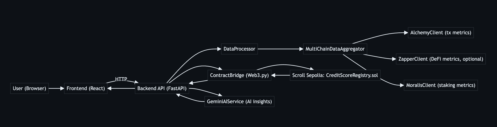
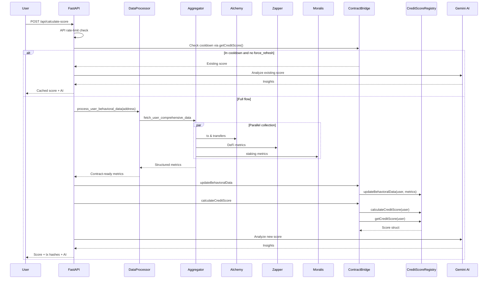
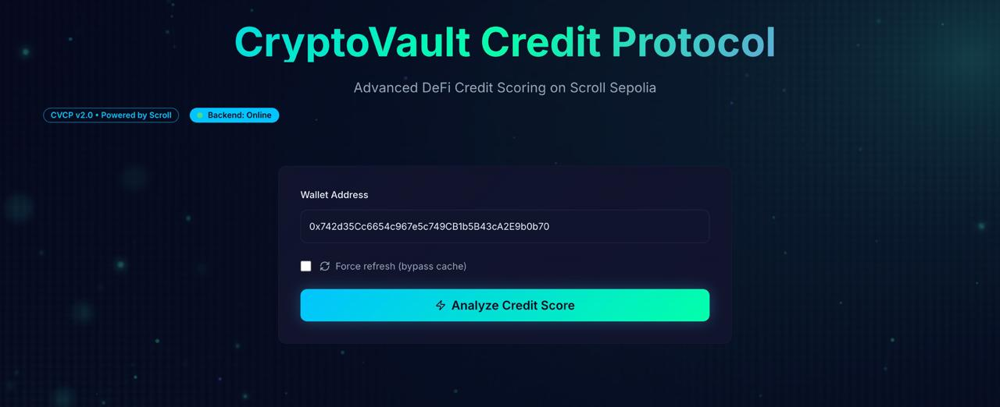
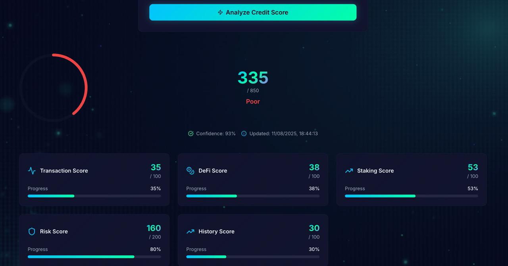
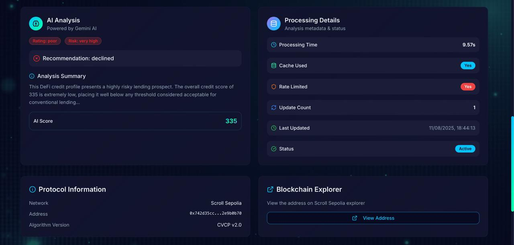

<h1 align="center"> CryptoVault Credit Protocol (CVCP) </h1>

<p align="center">
  <a href="https://shields.io"></a>
  <a href="https://fastapi.tiangolo.com/"></a>
  <a href="https://web3py.readthedocs.io/"></a>
  <a href="https://foundry-rs.github.io/"></a>
  <a href="https://react.dev/"></a>
  <a href="https://www.typescriptlang.org/"></a>
</p>

CVCP is an on-chain credit scoring protocol for Web3 users. It ingests behavioral metrics (transactions, DeFi interactions, staking patterns), enforces data quality and security invariants, and deterministically computes a credit score fully on-chain. The Protocol includes robust data collection, contract-level validation, provider authorization, and transparent score history.

### Key features
- Robust on-chain registry: `CreditScoreRegistry.sol` maintains credit scores and history, with provider authorization and pausability.
- Deterministic scoring: `ProtocolMath.sol` computes component scores and a normalized final score (target range 300–850) with invariants.
- Data quality enforcement: contract-side checks reject insufficient or unrealistic data; off-chain processing caps and normalizes inputs.
- Update cooldowns: per-user minimum update interval (1h on-chain) to mitigate spam and stabilize scores.
- Preview and history: pure preview function for estimation; persistent score history for change tracking and ML.
- Secure interactions: ReentrancyGuard, pausable admin controls, and provider allowlist.
- Resilient data collection: async multi-source aggregator (Alchemy, Zapper, Moralis) with retries, timeouts, and graceful degradation.
 - Hardened with OpenZeppelin: `Ownable`, `Pausable`, and `ReentrancyGuard` patterns for safe upgrades and operations.

### Component diagram


<br/>

## Protocol aspects

This prioritizes protocol robustness. The contracts encode invariants, validation, and controlled mutability to ensure consistent scoring and safe updates.

### `contracts/src/CreditScoreRegistry.sol`
- Core registry of credit scores with storage for:
  - `CreditScore` struct: `totalScore`, `transactionScore`, `defiScore`, `stakingScore`, `riskScore`, `historyScore`, `lastUpdated`, `confidence`, `updateCount`, `isActive`.
  - `ProcessedData` snapshot of the last submitted behavioral metrics + data quality + provider address.
  - Score history with capped length and update metadata for auditability.
- Access control and safety:
  - `onlyAuthorizedProvider` for data updates and score calculation.
  - `validUpdateInterval` cooldown to throttle updates.
  - `Pausable` and `ReentrancyGuard` to mitigate operational risk.
- Deterministic scoring pipeline:
  - `updateBehavioralData(address, BehavioralMetrics)` stores validated metrics and a computed data quality score.
  - `calculateCreditScore(address)` computes component scores with `ProtocolMath`, validates ranges, calculates total and confidence, updates storage, and emits events.
- Events for analytics/ML: `CreditScoreCalculated`, `BehavioralDataUpdated`, `ScoreHistoryUpdated`.
- Protocol versioning: `PROTOCOL_VERSION` constant for upgrades/clients.
- Data freshness: `calculateCreditScore` requires behavioral data not older than 24 hours; otherwise it reverts with `"Data too stale"`.
- Data quality threshold: `_calculateDataQuality` yields [0..100] and `updateBehavioralData` requires `>= 25`. Quality scoring weights: transactions up to 45, DeFi up to 35, staking up to 20.
- Metric integrity checks: `_validateMetrics` enforces bounds (e.g., `gasEfficiencyScore`, `consistencyMetric`, `protocolDiversityScore`, `portfolioVolatility` ≤ 100; `leverageRatio` ≤ 10000).
- Cooldown: `minimumUpdateInterval` (default 1 hour) enforces per-user throttling via `validUpdateInterval`; admin can adjust in [10 minutes, 7 days].
- History cap: `maxScoreHistory` (default 100) controls history array length; adjustable in [10, 1000].
- Normalization: total (0–1000 component space) is mapped to the 300–850 range with `normalized = total*550/1000 + 300`, then clamped to `[MIN_SCORE, MAX_SCORE]`.
- Confidence computation: `_calculateConfidence` derives a base from data quality with additive bonuses; result is capped at 100.
- Batch semantics: `batchCalculateScores` processes up to 50 users in one call, honoring per-user cooldown and existing stored behavioral data.

#### OpenZeppelin and security model
- Uses OpenZeppelin `Ownable` for admin-only controls (authorizing/revoking providers, updating parameters, pause/unpause).
- Uses OpenZeppelin `Pausable` to enforce maintenance windows. When paused, state-changing operations revert. Tests assert `Pausable.EnforcedPause`.
- Uses OpenZeppelin `ReentrancyGuard` to protect `calculateCreditScore` from reentrancy.
- `authorizedDataProviders` mapping governs who can update data/calculate scores. Constructor authorizes the initial owner by default.
- `validUpdateInterval` enforces per-user cooldown (`minimumUpdateInterval`, default 1 hour). Admin can update within bounds [10 minutes, 7 days].
- Admin parameter updates and provider changes emit events for transparency.

#### Public/view and batch functions
- `getCreditScore(address)` returns the full `CreditScore` struct.
- `getScoreHistory(address)` returns capped history of scores.
- `getBehavioralData(address)` returns the last submitted metrics and data quality.
- `previewScore(BehavioralMetrics)` is a pure estimator returning `(estimatedScore, confidence=75)`.
- `getUpdateMetadata(address)` exposes block number, a gas snapshot (`gasleft()` at update time), data hash, and previous score.
- `batchCalculateScores(address[])` bounded to 50 users, skips those not yet past cooldown.

### `contracts/src/ProtocolMath.sol`
- Pure functions for computing component scores from `BehavioralMetrics`.
- Validation helpers such as `validateComponentScore` and `validateFinalScore` ensure outputs remain within protocol bounds.
- Weighted aggregation and normalization to target the 300–850 score envelope.

Constants and scoring design:
- `MIN_SCORE=300`, `MAX_SCORE=850`, `COMPONENT_MAX=200`.
- Weights: transactions(25), DeFi(20), staking(25), risk(20), history(10) — sum to 100.
- Utility functions include logarithmic scaling, linear scaling, time-decay for durations, bell-curve normalization for frequencies, and capping helpers.

### `contracts/src/DataValidator.sol`
- Sanity checks for behavioral metric integrity and a simple confidence estimator.
- Caps values (e.g., transaction value, protocol counts) to avoid outliers and gaming.
 - Provided as a utility library for completeness checks; not required by `CreditScoreRegistry` flow, but available to integrators.

#### Verified by tests (Foundry)
- Authorization and cooldown: providers must be authorized; updates within the interval revert; admin can adjust interval within bounds.
- Pausability: when paused, state-changing ops revert with `Pausable.EnforcedPause`.
- Scoring invariants: component scores ≤ `COMPONENT_MAX`; final score within `[MIN_SCORE, MAX_SCORE]` for a wide range of inputs (including fuzz tests).
- Freshness: calculations with data older than 24h revert as expected.
- Preview: `previewScore` returns values within bounds and tracks actual calculations closely (delta < 50 in tests).
- History and batch: history length capped; batch calculation limited to 50 and updates eligible users only.

### Calculate Score: end-to-end sequence



### .env example (backend and optional frontend)

Create a `.env` in `backend/` with the following keys:

```bash
# Core chain + wallet
PRIVATE_KEY=0xYourPrivateKey
DEPLOYED_REGISTRY_ADDRESS=0x8e9288aD536Ee22Df91026BE96cB1deE904C05eF
RPC_URL=https://scroll-sepolia.g.alchemy.com/v2/YourAlchemyKeyOrRPC
CHAIN_ID=534351

# Gas and protocol controls (optional overrides)
SCROLL_SEPOLIA_GAS_PRICE=100000000
SCROLL_SEPOLIA_GAS_LIMIT=500000
MINIMUM_UPDATE_INTERVAL=1800

# API server
API_HOST=0.0.0.0
API_PORT=8000
API_DEBUG=false
RATE_LIMIT_PER_MINUTE=10
CACHE_DURATION_MINUTES=30
CORS_ORIGINS=*

# Data providers (set where available)
ALCHEMY_API_KEY=your_alchemy_key
ZAPPER_API_KEY=your_zapper_key
MORALIS_API_KEY=your_moralis_key

GEMINI_AI_API_KEY=your_gemini_key
```

Optionally, for the frontend root (if you wire the UI to the backend):

```bash
# frontend/.env
VITE_API_BASE_URL=http://localhost:8000
```

## Backend (FastAPI)

The API orchestrates rate-limiting, cooldown checks, data collection, on-chain updates, and AI insights.

- Endpoints:
  - `POST /api/calculate-score` — full pipeline, returns score, tx hashes, AI.
  - `GET /api/score/{address}` — fetch current on-chain score.
  - `GET /api/preview/{address}` — off-chain preview of metrics and estimated total.
  - `GET /api/analyze/{address}` — AI insights for an existing score.
  - `GET /api/rate-limit-status/{address}` — API + contract cooldown visibility.
  - `GET /api/contract-info`, `GET /health`, `GET /api/stats` — ops/diagnostics.

Resilience features:

- Async multi-source collection with per-source timeouts/retries; partial failures degrade gracefully.
- Input normalization and caps; contract rejects unrealistic or stale data.
- Provider allowlist and cooldown enforced on-chain; API respects cooldown and returns cached scores.

Run locally:

```bash
cd backend
python3 -m venv venv && source venv/bin/activate
pip install -r requirements.txt
python start_api.py
# API at http://localhost:8000, docs at /docs
```

## Frontend (React + TypeScript)

Polished UI demonstrating the scores and AI-generated analytics. Connect the backend and see your credit score light up — set `VITE_API_BASE_URL`, click Analyze, and watch it go.

<div align="center">
  
  <br/>
  
  <br/>
  
  <br/>
  <br/>
</div>

Dev:
```bash
cd frontend
pnpm|bun|npm install
pnpm|bun|npm run dev
```

## 🛠 Tech stack

| Layer      | Technologies |
|------------|-------------|
| Smart contracts | Solidity (0.8.20), OpenZeppelin (Ownable, Pausable, ReentrancyGuard), Foundry |
| Chain | Scroll Sepolia |
| Off-chain bridge | Web3.py, eth-account |
| Backend | FastAPI, Pydantic, Uvicorn, Loguru |
| Data collection | Alchemy, Moralis, Zapper (optional) via aiohttp/asyncio |
| AI insights (optional) | Google Gemini |
| Frontend | React, TypeScript, Shadcn UI/Tailwind |

## 🤝 Contributing

We welcome contributions that enhance protocol safety, data integrity, or developer experience.

1. Fork and create a feature branch.
2. Add tests (contract or backend) for your change.
3. Ensure contracts compile and tests pass (Foundry) and backend linters/tests pass.
4. Open a PR with a clear description, rationale, and security considerations.

Security-minded contributions (invariants, fuzzing, pre/post conditions) are highly appreciated.

## 📄 License

This project is licensed under the MIT License — a short and permissive license that allows users to use, copy, modify, merge, publish, distribute, sublicense, and/or sell copies of the software, provided that proper attribution is given.  
For more details, please see the [LICENSE](./LICENSE) file in this repository.

#


<div align="center">
  <sub><b>Made with 💙 for Web3 and DeFi — building transparent, verifiable credit on-chain.</b></sub>
  <sub><b>Empowering DeFi with intelligent credit scoring</b></sub>

</div>


#
